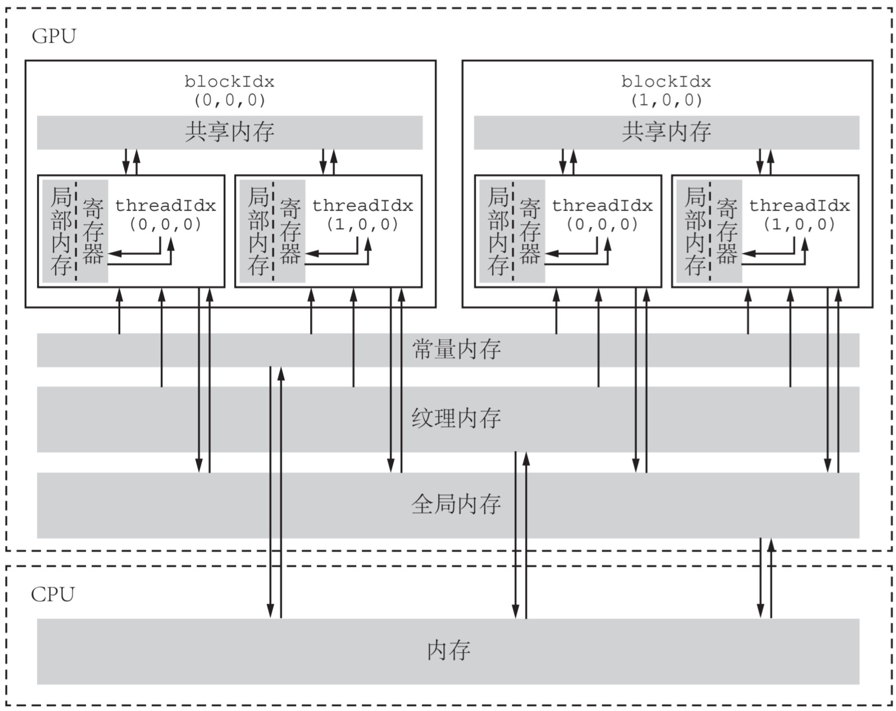

# CUDA 的内存组织

*CUDA 中设备内存的分类与特征*
| 内存类型  | 物理位置 |   访问权限  | 可见范围 | 生命周期 |
|:------------:|:---------------:|:--------------:|:---------------:|:--------------:|
| 全局内存 | 在芯片外 | 可读可写 | 所有线程和主机端 | 由主机分配与释放 |
| 常量内存 | 在芯片外 | 仅可读 | 所有线程和主机端 | 由主机分配与释放 |
| 纹理和表面内存 | 在芯片外 | 一般仅可读 | 所有线程和主机端 | 由主机分配和释放 |
|寄存器内存|在芯片内|可读可写|单个线程|所在线程| 
|局部内存|在芯片外|可读可写|单个线程|所在线程|
|共享内存|在芯片内|可读可写|单个线程块|所在线程块|

*CUDA 中的内存组织示意图*


------

## CUDA 中不同类型的内存

CUDA 中的内存类型有：全局内存、常量内存、纹理内存、寄存器、局部内存、共享内存。
CUDA 的内存，即设备内存，主机无法直接访问。

------

### 全局内存

**全局内存（global memory）**：核函数中所有线程都可以访问的内存，可读可写，由主机端分配和释放。如 `cudaMalloc()` 的设备内存 `d_x`, `d_y`, `d_z`。

全局内存由于没有放到 GPU 芯片上，所以具有较高的延迟和较低的访问速度，但是容量大（显存）。全局内存主要为核函数提供数据，并在主机和设备、设备和设备之间传递数据。

全局内存的生命周期由主机端维护，期间不同的核函数可以多次访问全局内存。

除以上动态分配的全局内存变量外，还可以使用 **静态全局内存变量**，其所占内存数量在编译器确定。这样的静态全局内存变量必须在所有主机和设备函数外部定义，例如：  

```cuda  
__device__ real epsilon;  // 单个静态全局内存变量， `__device` 表示是设备中的变量。
__device__ real arr[10];  // 固定长度的静态全局内存数组变量。
```

对于静态全局内存变量，其访问权限：  
1. 核函数中可以直接访问静态全局内存变量，不必以参数形式传给核函数；
2. 主机中不可以直接访问静态全局内存变量，可以通过 `cudaMemcpyToSymbol()` 和 `cudaMemcpyFromSymbol()` 调用。  

------

### 常量内存

**常量内存（constant memory）**：仅有 64 kb，可见范围和生命周期与全局内存一样，具有缓存而高速，仅可读、不可写。在核函数中定义常量内存变量，如：  

```cuda  
__constant__ real epsilon;  // 单个常量内存变量， `__constant__` 表示是常量内存变量。
__constant__ real arr[10];  // 固定长度的常量内存数组变量。
```

使用常量内存的方法：一是在核函数外定义常量内存变量；二是向核函数传递常量参数，默认存放在常量内存：  
1. 核函数中可以直接访问常量全局内存变量，不必以参数形式传给核函数，但不可更改（只读）；
2. 主机中不可以直接访问常量全局内存变量，可以通过 `cudaMemcpyToSymbol()` 和 `cudaMemcpyFromSymbol()` 调用。

------

### 纹理内存

**纹理内存(texture memory)**，类似常量内存，也是一种具有缓存的全局内存，具有相同可见范围和生命周期。

可以将某些只读的全局内存数据用 `__ldg()` 函数通过只读数据缓存（read-only data cache）读取，既可以达到使用纹理内存的加速效果，又可使代码简洁：  

```cuda
int __ldg(const int* ptr);  // 函数原型。
```

全局内存的读取在默认情况下就利用了 `__ldg()` 函数，所以不需要显式地使用。

------

### 寄存器

在核函数中定义的、不加任何限定符的变量一般存放在 **寄存器（register）**；核函数中不加任何限定符的数组可能放在寄存器，也可能放在局部内存中。寄存器可读可写。

各种内建变量，如 gridDim、blockDim 等都保存在特殊的寄存器中。

寄存器变量仅被一个线程看见，寄存器的生命周期也和所属线程相同。

寄存器内存在芯片上，是所有内存中访问速度最高的。一个寄存器占 32b（4字节），一个双精度浮点数占 2个寄存器。

------

### 局部内存

局部内存（local memory）也是全局内存的一部分，每个线程最多可以使用 512 kb 的局部内存，但过多使用会降低性能。

局部内存的用法类似寄存器。

------

### 共享内存

共享内存（shared memory）与寄存器类似，都是位于芯片上，读写速度较快。

共享内存对整个线程块可见，一个线程块上的所有线程都可以访问共享内存上的数据；共享内存的生命周期也与所属线程块一致。

共享内存的主要作用是减少对全局内存的访问，或者改善对全局内存的访问模式。

------

### L1 和 L2 缓存

SM 层次的 L1 缓存（一级缓存）和设备层次 L2 缓存（二级缓存）。它们主要用来缓存全局内存和设备内存的访问。

------

## SM 及其占有率

一个 GPU 是由多个 SM (Streaming Multiprocessor) 构成的。一个 SM 包含如下资源：

- (1) 一定数量的**寄存器**。
- (2) 一定数量的**共享内存**。
- (3) 常量内存的缓存。
- (4) 纹理和表面内存的缓存。
- (5) L1缓存。
- (6) 两个（计算能力6.0）或4个（其他计算能力）**线程束调度器**（warp scheduler）用于不同线程的上下文之间迅速地切换，以及为准备就绪的线程束发出执行指令。
- (7) 执行核心，包括：
    - a) 若干整型数运算的核心（INT32）。
    - b) 若干单精度浮点数运算的核心（FP32）。
    - c) 若干双精度浮点数运算的核心（FP64）。
    - d) 若干单精度浮点数超越函数（transcendental functions）的特殊函数单元（special function units, SFUs）。
    - e) 若干混合精度的张量核心（tensor cores，由伏特架构引入，适用于机器学习中的低精度矩阵计算）。

一般来说，要尽量让 SM 的占有率不小于某值（如 25%），才有可能获得较高的性能。

+ 一个 SM 中最多拥有的线程块个数 $N_b=16$（开普勒和图灵架构）或 $N_b=32$（麦克斯韦、帕斯卡和伏特架构）；
+ 一个 SM 中最多拥有的线程格式为 $N_t=1028$（图灵架构）或 $N_t=2048$（开普勒到伏特架构）。

在线程块中，每 32 个连续线程为一个 **线程束**。
SM 中线程的执行是以线程束为单位的，所以最好将线程块大小取为线程束大小（32个线程）的整数倍（如 128）.

------

## CUDA 运行时 API 函数查询设备

使用 CUDA 运行时 API 函数查询所用GPU 规格。
```
Device id: 0
Device name: NVIDIA GeForce RTX 4090
Compute capability: 8.9
Amount of global memory: 23.9878 GB
Amount of constant memory: 64 KB
Maximum grid size: 2147483647, 65535, 65535
Maximum block size: 1024, 1024, 64
Number of SMs: 128
Maximum amount of shared memory per block: 48 KB
Maximum amount of shared memory per SM: 100 KB
Maximum number of registers per block: 64 K
Maximum number of registers per SM: 64 K
Maximum number of threads per block: 1024
Maximum number of threads per SM: 1536
```
------
